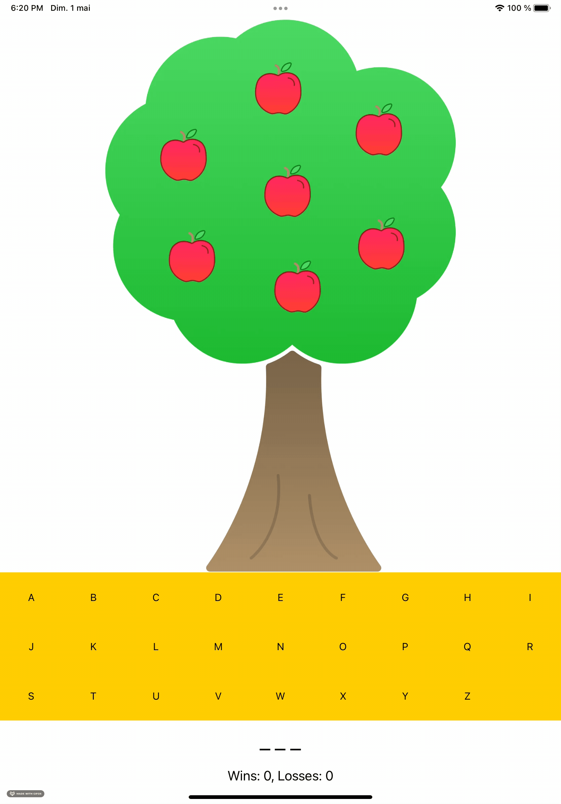

# Apple Pie

## Qu'est-ce que c'est ?

Apple Pie est une application iOS inspiré du jeu du pendu. Le but est de découvrir le mot secret lettre par lettre en un nombre d'essais limité. 

## Contexte 

Apple Pie est le 2 ème projet de [App Development with Swift](https://books.apple.com/us/book/app-development-with-swift/id1465002990) (Apple, 2017), un guide d'apprentissage du développement d'applications iPhone.

Le projet a été développé en suivant les instructions du guide, bien que plusieurs libertés aient été prises dans la réalisation. 

D'un point de vue pédagogique, ce projet entraine entre autres à l'acquisition des éléments suivants :   
-    Vues, contrôles et contrôleurs de UIKit : UIImageView, UIStackView, UILabel, UIButton, UIViewController...
- Contraintes Autolayout notamment via le storyboard.
- Mise en place d'un fichier `model` Game pour la gestion non persistante des données du jeu.

## Compatibilité 

L'application est optimisée pour iPad Pro/iOS 14.

## Captures

